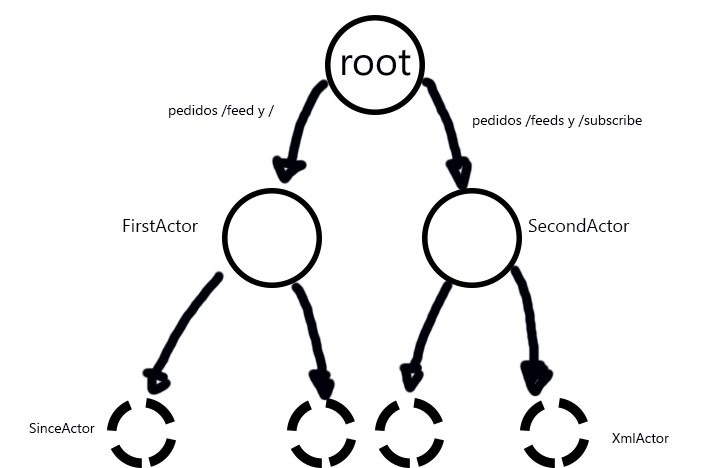

# Informe de Laboratorio 3

## Programación Concurrente Usando Actores

### Introduccion

Scala es un lenguaje de programación híbrido que integra características de los lenguajes funcionales y orientados a objetos.
Este lenguaje propone un modelo seguro de concurrencia basado en Actores. Los Actores son procesos concurrentes que se comunican mediante el intercambio de mensajes.
Un actor realiza tareas sencillas:

*   Almacena información
*   Procesa información
*   Recibe mensajes de otros actores
*   Envía mensajes a otros actores
*   Crea nuevos actores

### Parte 1)

`observacion` : La app fue corrida siempre con HTTPie (ya que en curl es necesario agregar ciertos msj para los response 200 y 404)

`2da observacion` : El parametro since no se tomo como un "desde" sino como un "hasta", filtra los elementos cuyos pubdate sean anteriores al valor que tenga since, ya que en la consigna quedo medio ambigua. " El parámetro opcional since deberá utilizarse para filtrar todos aquellos items cuya fecha de publicación sea anterior a el valor de la fecha since ".

Para la parte 1 tuvimos que disenar una especie de comunicacion entre actores que permitiera realizar el parseo de un xml de forma asincrona, concurrentemente para hacer la aplicacion mas eficiente, para ello nos enfretamos a varios problemas :
* ¿Que son los futuros?

Los **futuros** son objetos que tienen un determinado valor que puede estar disponible en un momento determinado.
Si los cálculos no se han completado entonces decimos que el **futuro** esta incompleto y 
si los cálculos se completaron con algún valor o una excepción entonces se puede decir que el **futuro** se ha finalizado, estos siempre vienen acompano de metodos(`onComplete()`) para cerciorarse de que este futuro efectivamente halla terminado bien, o mal(ejemplo mas abajo).
Aqui en el ejemplo tambien se aprecia la relacion que hay entre actores y futuros.
```scala
 val futureHello: Future[String] = (principalActor ? HelloWorld).mapTo[String]
          onComplete(futureHello){
            case Success(hello) => 
              complete(hello) 
            case Failure(err) => 
              complete(StatusCodes.BadRequest -> s"Bad Request: ${err.getMessage}\n") 
          }

```
Los actores reciben mensajes, como bien se dijo, entre las funciones para comunicarse con los actores (y pedirles que hagan cosas) se encuentra `:?` es un metodo, que le pasa el msj `HelloWorld` al actor `principalActor`, este metodo devuelve un `Future[String]`, que como todo futuro debera checkearse.

*  ¿Para qué fueron utilizados en su implementación?

Los **futures** fueron utilizados en nuestra implementacion para hacer concurrentes los pedidos que llegan a la aplicacion.
Aqui se puede observar como se ejectura concurrentemente el siguiente codigo, por una lado estamos parseado el xml y por otro seteando el formato pertinente del parametro since(*para poder luego filtrar*)
```scala
val sinceresponse:Future[Option[Date]] = ((sinceActor ? GetSince(since)).mapTo[Option[Date]])
val xmlresponse:Future[xml.Elem] = ((xmlActor ? Getxml(url)).mapTo[xml.Elem])
```
Aqui por ejemplo decimos que una vez que se hayan completado los futuros usaremos este resultado para otro futuro que luego checkearemos con algun metodo pertinente.
```scala
val feed = for{
          x1 <- sinceresponse
          x2 <- xmlresponse
          x3 <- Future{
            val feedinfo = parsedfeedinfo(x2)
            FeedInfo(feedinfo.title, feedinfo.description,parsedfeedinfo(x2).items.filter(c => testDate(c.pubDate, x1))) 
            } 
          }yield(x3)
```
>Otro ejemplo de como se "relacion los futuros" 


*  ¿Qué problemas traería el implementar este sistema de manera síncrona?

Uno de los problemas es la perdida de eficiencia que tenemos al no tener un codigo concurrente.
En este caso para no tener que lidiar con la secuencialidad se utilizan Actores y Futuros para facilitar la concurrencia.

*  ¿Qué les asegura el sistema de pasaje de mensajes y cómo se diferencia con un semáforo/mutex?

Los **Actores** se comunican por mensajes asincronos y cada uno tiene su cola de mensajes(lo que le permite recibir mensajes en cualquier momento dado).
los actores procesan los mensajes haciéndolos coincidir con patrones de secuencia que pueden ser valores o declaraciones y 
si coincide entonces se realizara un calculo y el resultado correspondiente se retorna a la referencia por medio de un mensaje.

El modelo de actores fuerza a una porción de codigo a ser concurrente sin tener que preocuparse explícitamente de los mecanismos de **exclusion mutua**, entre otros, que al utilizarlas para tratar de resolver problemas de concurrencia pueden ocasionar problemas secundarios como estados no deseados **condiciones de carrera**.

### Parte 2)

Basicamente la idea principal es mediante el POST/subscribe guardar en la variable :
```scala
var listafeed: List[xml.Elem] = List()
```
Una lista de xmls ya parseados (`listafeed esta declarada como var ya que puede ir mutando a lo largo del tiempo, recibiendo mas xmls ie haciendo varios POST`), esta variable sera checkeada a la hora de hacer un GET/feeds ya que si no hay ningun xml parseado GET/feeds no hara nada, por el contrario si hay debera filtrarlo con el parametro since.

```scala
if(listafeed.isEmpty){
            complete(StatusCodes.BadRequest -> "No estas subscrito a ninguna pagina:\n")
          }else{
            parameter("since". ?){ (since) =>...
```

* Jerarquia de actores planteada

Tuve muchisimos problemas planteando la jerarquia, esta fue la resultate.
La idea basicamente fue : Una vez en el main crear dos actores a partir del /userguardian

```scala
val principalActor = system.actorOf(Props[PrincipalActor])
val secondActor = system.actorOf(Props[SecondActor])
```
Estos actores se encagaran de manejar los tipos de pedidos que llegan a la aplicacion: 
POST/subscribe; GET/feeds por un lado y GET/feed; GET/"" por el otro.
A su vez tanto principalActor como secondActor crean nuevos actores que les ayudaran en su tarea, ie se "comparten laburo". (Mas abajo en el protocolo de msj se explica mas detallado)


>Jerarquia de actores implementada

* Protocolo de mensajes entre actores

Tenemos varios msj que nos ayudan a comunicarnos con nuestros actores. Cada actor se encuentra en su respectivo .scala en cada archivo nos encontraremos los msjs que utiliza cada actor.

### PrincipalActor : 
*el contexto o la ubicacion de las citas de codigo se encuentra detallada como comentario arriba de las citas*

```scala
//cases de principalActor
case object HelloWorld 

case class GetFeed(url: String,since: Option[String])
```
Por un lado el msj `HelloWorld` le llega a principalActor cdo tenemos el endpoint "" 

```scala
 //en el main
 path("") {
        get {
          implicit val timeout: Timeout = 5.seconds
          val futureHello: Future[String] = (principalActor ? HelloWorld).mapTo[String]
          ....
```
Entonces en el receive de principalActor cuando el actor verifique el msj, se econtrara con que se trata del case `HelloWorld` y lo que hara sera crear un actor *helloActor* y enviarle este msj para que haga la tarea designada, .
```scala
//receive de principalActor, en el case HelloWorld
val futhello: Future[String] = (helloActor ? HelloWorld).mapTo[String]
```
```scala
//receive de helloActor  
def receive = {
    case HelloWorld => sender ! "Hello, World!"
```
por otro lado tenemos el msj `GetFeed(url,since)`, este le llega a principalActor cdo tenemos el endpoint "/feed"

```scala
//en el main
val futurefeed: Future[FeedInfo] = 
                (principalActor ? GetFeed(url,since)).mapTo[FeedInfo]
```
en principalActor nos toparemos en el case `GetFeed(url,since)` y lo que haremos sera similar a lo anterior, crearemos un actor para parsear la url y otro para parsear el since y formatearlo.

```scala
//en el receive de principalActor, en el case GetFeed(url,since)
val sinceresponse:Future[Option[Date]] = ((sinceActor ? GetSince(since)).mapTo[Option[Date]])
val xmlresponse:Future[xml.Elem] = ((xmlActor ? Getxml(url)).mapTo[xml.Elem])
```
aca aparecen dos nuevos msj `GetSince(since)`(se encuentra definido en *SinceActor*) y `Getxml(url)`(se encuentra definido en *XmlActor*) ya que lo hemos dividido, basicamente lo importante es el campo "since" y "url" el cual tendra la informacion para que dichos actores puedan parsear el xml en el caso de la url o parsear el since.

```scala
//caso correspondiente al msj, este es sinceActor
def receive = {
      case GetSince(since) => { 
      ..
```
```scala
//caso correspondiente al msj, este es xmlActor
def receive = {    
      case Getxml(url) => {
      ..  
```


### SecondActor :

```scala
//cases de SecondActor
case class GetFeedtoxml(xmlparsed: List[xml.Elem],since: Option[String])

case class SubscribeUrl(url:String)
```
por un lado el msj `SubscribeUrl(url)` le llega al actor cdo hay un endopoint "/subscribe"

```scala
//en el main
val futuresubscribe: Future[xml.Elem] = 
            (secondActor ? SubscribeUrl(url)).mapTo[xml.Elem]
```
entonces en el receive de secondActor se encontrara que se trata del case `SubscribeUrl(url)`
el cual creara un nuevo actor (*xmlActor*) para que le ayude al parseo del xml 
```scala
//en el receive de secondActor, en el case SubscribeUrl(url)
val xmlresponse:Future[xml.Elem] = ((xmlActor ? Getxml(url)).mapTo[xml.Elem]) 
```
aca aparece nuevamente el msj `Getxml(url)` el cual se enviara a xmlActor.

* observacion:
Aca se ve como es que en un endopint subscribe parseo el xml para posteriormente "guardarlo" y poder usarlo cdo necesite hacer un get /feeds, segun la consigna no especifica si esto se debe hacer asi o guardar la url para posteriormente en un get hacer este procedimiento(parsear el xml) o guardarlo ya como un feedinfo, supongo que esta bien de todas formas.

por otro lado tenemos el msj `GetFeedtoxml(listxmlparsed, since)` este le llega al actor cdo tenemos un endpoint "/feeds" 

```scala
//en el main
val futurefeed: Future[List[FeedInfo]] = 
                  (secondActor ? GetFeedtoxml(listfeeds,since)).mapTo[List[FeedInfo]]    
```
luego en el receive de secondActor, en el case `GetFeedtoxml(listxmlparsed, since)` lo que haremos sera crear un sinceActor para que nos ayude con el parametro.
```scala
//en el receive de secondActor, en el case GetFeedtoxml(listxmlparsed, since)
x1 <- (sinceActor ? GetSince(since)).mapTo[Option[Date]]
```
nuevamente aparece el msj `GetSince(since)`
una vez ya parseado el since usaremos una simple funcion para hacer el feedinfo del xml (que ya ha sido parseado en el post) y filtrarlo con el parametro since. 

